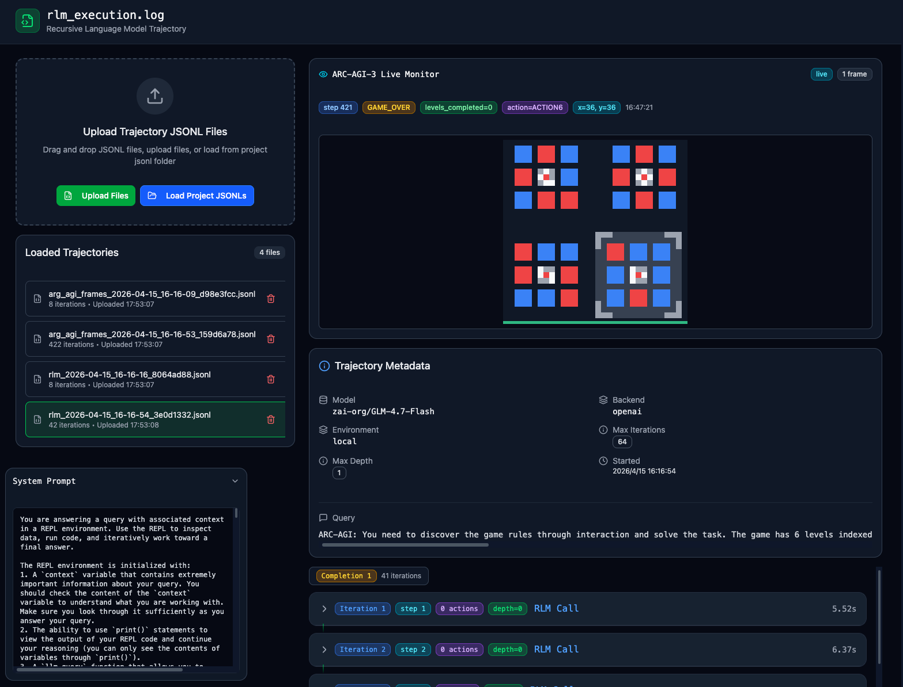
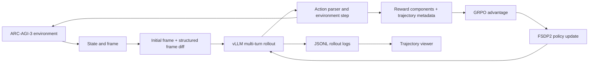

[English](README.md) | [简体中文](README_zh-CN.md)

# Long-Horizon LLM Agent Post-Training for ARC-AGI-3

An exploratory research project on adapting language-model agents to long-horizon, interactive ARC-AGI-3 environments through recursive inference, multi-turn reinforcement learning, compact visual observations, and trajectory-level diagnosis.

> **Project status.** The experiments established an end-to-end training and analysis workflow, but did not produce a policy with stable level completion. The most useful outcomes are the infrastructure, failure analysis, and lessons for future long-horizon agent training. The code and sanitized experiment artifacts are being consolidated into this repository.

## Trajectory viewer

<p align="center">
  
</p>

<p align="center"><em>An unsuccessful zero-shot RLM trajectory ending in GAME_OVER with zero levels completed. The viewer aligns environment frames with model responses, REPL execution, actions, and run metadata for failure diagnosis.</em></p>

The interactive viewer supports:

- drag-and-drop playback of RLM and ARC environment JSONL logs;
- live monitoring and offline inspection of long trajectories;
- synchronized frames, actions, model responses, REPL/tool outputs, and timing;
- per-action post-state reconstruction from structured events, paired frame logs, or legacy REPL outputs;
- completion- and iteration-level navigation across multiple runs.

Viewer source, animated demo, and detailed documentation: [Trajectoryvisualizationwebpage](https://github.com/yuran986/Trajectoryvisualizationwebpage)

## Research questions

- Can recursive language-model inference solve interactive ARC tasks without task-specific training?
- Can stateful, multi-turn RL improve exploration and delayed-credit assignment?
- How can visual state be represented compactly without losing information needed for grounding?
- Which reward signals improve actual progress rather than merely increasing the training score?

## Project evolution

### 1. Zero-shot recursive inference

I first adapted [Recursive Language Models (RLM)](https://github.com/alexzhang13/rlm) to interact with ARC-AGI-3 environments and served GLM-4.7-Flash locally with vLLM. The agent could inspect state and execute actions through a REPL, but long trajectories exposed weak visual grounding, rapid context growth, repeated ineffective actions, and unreliable recovery from early mistakes.

### 2. Multi-turn post-training

I then built a stateful GRPO training pipeline on [SkyRL](https://github.com/NovaSky-AI/SkyRL), using Qwen2.5-3B and Qwen3-8B policies with FSDP2 training and vLLM rollouts on a 4×A6000 node. The environment wrapper preserved game state across turns and logged complete trajectories for later inspection.

To reduce observation length, each rollout received the initial frame followed by structured adjacent-frame differences and local changed patches instead of repeatedly serializing the entire screen.

### 3. Reward and optimization ablations

Dense progress signals made optimization easier, but agents learned repetitive clicks that accumulated scalar reward without completing a level. I also tested:

- **oracle-distance warm-up:** provided a clearer progress signal, but encoded game-specific knowledge and was dropped because it was unlikely to generalize;
- **KL regularization:** constrained policy drift, but produced limited practical gains in the tested setting;
- **controlled reward shaping:** separated score improvement from genuine environment progress and made reward-hacking behavior easier to identify.

Because ARC-AGI-3 made it difficult to separate training-pipeline issues from sparse-feedback exploration failures, I also began an experimental adaptation to **ALE-Bench** as a denser-feedback testbed. This branch remained exploratory rather than becoming a completed benchmark study.

## System overview



## Main findings

- A rising training reward did not imply improved level completion.
- Dense scalar rewards created exploitable local incentives, especially repetitive-action loops.
- Compact frame differences reduced context usage, but representation efficiency alone did not solve visual grounding.
- Long-horizon interaction amplified early mistakes and made sparse terminal feedback difficult to assign.
- Oracle guidance can stabilize a narrow task while undermining the goal of cross-game generalization.
- A stronger base model or additional KL control was insufficient without better state abstraction, exploration, and progress signals.

## Experimental components

| Component | Role | Outcome |
|---|---|---|
| Zero-shot RLM agent | Test recursive inference without training | Produced useful traces, but no reliable level completion |
| Stateful SkyRL environment | Preserve interactive state across rollout turns | Enabled end-to-end multi-turn GRPO experiments |
| Initial frame + frame diffs | Reduce observation-token growth | More compact trajectories; grounding remained a bottleneck |
| Dense reward shaping | Supply intermediate learning signals | Improved scalar reward but exposed reward hacking |
| Oracle-distance warm-up | Provide directed early-stage supervision | Too game-specific for the desired generalization |
| KL regularization | Limit destructive policy drift | Stable to run, with limited observed benefit |
| ALE-Bench adaptation | Test the pipeline with denser environment feedback | Exploratory branch used to investigate task difficulty and feedback sparsity |
| Trajectory viewer | Align behavior, state, and training signals | Made repeated-action and grounding failures inspectable |

## Repository roadmap

- [x] Add project overview and research conclusions
- [x] Publish the trajectory-viewer example
- [ ] Extract the environment adapter and observation encoder
- [ ] Add sanitized training configurations and launch scripts
- [ ] Release representative trajectories and evaluation summaries
- [ ] Document reproducible setup and evaluation commands

## Intended repository structure

```text
.
├── configs/          # Sanitized experiment configurations
├── docs/             # Design notes and experiment summaries
├── examples/         # Example rollouts and usage
├── fig/              # README and analysis figures
├── scripts/          # Training, serving, and evaluation entry points
├── src/              # Environment, observation, reward, and logging code
└── viewer/           # Viewer integration notes or submodule reference
```

## Limitations

This was an exploratory research effort rather than a completed benchmark result. Experiments covered a limited set of games and compute budgets, and neither the oracle-guided nor KL-regularized variants yielded a general solution. Reported conclusions are therefore qualitative and are intended to guide the next iteration rather than claim ARC-AGI-3 performance.

## Acknowledgments

This project builds on [ARC-AGI-3](https://arcprize.org/arc-agi/3/), [RLM](https://github.com/alexzhang13/rlm), [SkyRL](https://github.com/NovaSky-AI/SkyRL), vLLM, and PyTorch FSDP2.
