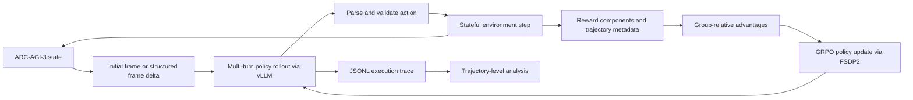

[English](README.md) | [简体中文](README_zh-CN.md)

# Long-Horizon LLM Agent Post-Training for ARC-AGI-3

A research artifact studying language-model post-training in long-horizon, interactive environments with sparse and potentially exploitable feedback.

**Status:** research artifact under release preparation · **Period:** January–May 2026 · **Primary task:** ARC-AGI-3 `ft09` · **Companion tool:** [RLM Trajectory Viewer](https://github.com/yuran986/Trajectoryvisualizationwebpage)

## Abstract

ARC-AGI-3 combines visual grounding, hidden-rule discovery, exploration, and delayed credit assignment in a stateful environment. This project asks whether externalized recursive inference and reinforcement-learning post-training can improve an LLM agent on that combination. We first built a zero-shot Recursive Language Model (RLM) agent that interacts with the environment through a REPL, then integrated ARC-AGI-3 into SkyRL for stateful multi-turn GRPO with Qwen2.5-3B and Qwen3-8B policies. The system includes structured frame-difference observations, component-wise rewards, oracle-distance warm-up, KL regularization, distributed FSDP2 training, vLLM rollout generation, and trajectory-level visualization.

The experiments did **not** yield stable level completion. Their central result is diagnostic: denser shaping improved scalar reward while leaving `pass@1` and completed levels unchanged. Trajectory inspection showed that the policy exploited a repeatable local transition rather than learning sustained visual reasoning. The project therefore contributes an end-to-end experimental system and a controlled negative result about reward design for long-horizon agents, rather than a solved ARC-AGI-3 policy.

> **Main finding:** reward improvement was not capability improvement. In the strongest controlled comparison, all 16 sampled trajectories found the same single oracle-progress action and then produced 144/160 no-progress actions; level completion remained zero.

## Contributions

- An end-to-end stateful ARC-AGI-3 integration spanning multi-turn rollout, action validation, decomposed rewards, GRPO updates, and trajectory logging.
- A token-efficient observation interface based on an initial full frame followed by structured adjacent-frame deltas and local changed patches.
- Controlled oracle-distance, no-progress-penalty, meaningful-diff, and KL ablations that separate scalar reward gains from task progress.
- A trajectory-analysis workflow that aligns model reasoning, REPL execution, actions, and post-action frames to expose behavioral failure modes.

## Method



### Stage I: zero-shot recursive inference

We adapted [RLM](https://github.com/alexzhang13/rlm) to expose ARC-AGI-3 state and actions as REPL functions and served GLM-4.7-Flash locally through vLLM. External variables let the model retain frames, crop regions, compute differences, and query long context without inserting every full observation into the prompt. This baseline produced interpretable exploration traces, but remained highly dependent on the base model and failed under long context, weak spatial grounding, repeated ineffective actions, and poor recovery from early errors.

### Stage II: stateful multi-turn GRPO

We implemented a SkyRL environment that preserves game state across turns, validates textual and coordinate actions, and records the full transition history. A rollout emits reasoning plus a final action block; the environment executes only the last action, checks it against the current action space, advances the game, and returns the next compact observation and decomposed reward.

### Observation design

The initial turn contains the goal, available actions, coordinate range, color legend, and complete `64×64` frame. Later turns contain the previous action, environment state, and an adjacent-frame delta:

```text
observation_t = state_t + action_{t-1} + diff(frame_{t-1}, frame_t) + local changed patches
```

Diff metadata includes the number of changed cells, bounding box, color-transition counts, and connected components. Redundant copies of the previous model output were removed because SkyRL already retains the multi-turn chat history.

### Reward design

The base reward combines task progress with weak behavioral shaping:

```text
r_t = level_progress + meaningful_diff - invalid_action - repeated_click
```

For warm-up experiments, a legal game-specific solver defines an oracle distance `d(s)` and supplies potential-style progress without requiring imitation of a unique action sequence:

```text
oracle_progress_t = [d(s_{t-1}) - d(s_t)] × oracle_distance_reward
```

States that become unrecoverable receive an additional penalty. This signal was useful for controlled diagnosis but was not adopted as a general solution because it encodes `ft09`-specific knowledge.

## Experimental setup

| Dimension | Configuration |
|---|---|
| Environment | ARC-AGI-3, primary experiments on `ft09` |
| Zero-shot model | GLM-4.7-Flash served with vLLM |
| Trainable policies | Qwen2.5-3B-Instruct; Qwen3-8B |
| Optimization | Stateful multi-turn GRPO with optional KL regularization |
| Training system | SkyRL, PyTorch FSDP2, vLLM |
| Hardware | 4×NVIDIA A6000; typically 2 training + 2 rollout GPUs, with selected Qwen3 runs using 3+1 |
| Context profiles | 16K/18K after diagnosing premature termination near 8K tokens |
| Primary metrics | `pass@1`, levels completed, invalid actions, oracle progress, no-progress actions, reward components |

## Results

### Oracle-distance warm-up ablation

| Variant | Key change | Final avg. score | `pass@1` | Levels completed | Behavioral outcome |
|---|---|---:|---:|---:|---|
| v1 | Oracle progress + weak meaningful-diff reward | `0.055` | `0.0` | `0.0` | Learned one progress transition, then stalled |
| v2 | Add `-0.01` no-progress penalty | `-0.035` | `0.0` | `0.0` | Accepted repeated penalties instead of finding the next transition |
| v3 | Increase meaningful-diff reward to `0.01` | `-0.030` | `0.0` | `0.0` | Same behavior; 16/160 progress and 144/160 no-progress actions at step 200 |

Scalar rewards across variants are **not directly comparable** because the reward definition changes. The task metrics are stable: every reported variant has zero `pass@1` and zero completed levels. The apparent v2→v3 score gain is explained by the larger shaping coefficient, not by better behavior.

### Failure analysis

| Observation | Evidence | Implication |
|---|---|---|
| Valid actions are not sufficient | Invalid actions reached zero while progress remained zero | Syntax/control learning and task learning must be evaluated separately |
| Dense reward can reinforce a local optimum | The policy repeatedly clicked a region that reliably changed pixels | Auxiliary rewards require behavioral audits, not only aggregate curves |
| Providing a diff does not ensure grounding | The agent sometimes claimed no change after receiving a 38-cell delta | Observation compression and observation use are distinct problems |
| Penalties do not create exploration | The no-progress penalty changed score but not the action pattern | Escaping a local policy likely requires curriculum, demonstrations, or stronger search |
| KL is a stabilizer, not task supervision | Higher KL constrained collapse but did not teach the hidden visual rule | Conservative updates cannot replace informative initialization |

## Trajectory analysis

<p align="center">
  
</p>

<p align="center"><em>The companion viewer aligns live/offline frames, run metadata, model responses, REPL execution, action events, and per-iteration action counts. The displayed zero-shot trajectory ends in GAME_OVER with no completed levels.</em></p>

The [RLM Trajectory Viewer](https://github.com/yuran986/Trajectoryvisualizationwebpage) provides the animated demo and implementation details. Its purpose is experimental auditing: it reconstructs behavior behind an aggregate reward and exposes repeated clicks, ignored state changes, truncation, and action-to-frame mismatches.

## Auxiliary testbed: ALE-Bench

ARC-AGI-3 entangles visual grounding with hidden rules and sparse terminal feedback. To distinguish task difficulty from failures in the RL pipeline, we also implemented an exploratory ALE-Bench integration with code parsing, public-judge execution, signed/normalized verifier rewards, multi-turn improvement signals, SkyRL launchers, an Apptainer backend for the cluster environment, and a rollout viewer. This branch reached a minimal trainable system but did not establish stable learning gains; it remains an auxiliary diagnostic testbed rather than a reported positive result.

## Artifact and reproducibility status

| Artifact | Status |
|---|---|
| Research design, configurations, and negative results | Documented in this README |
| Interactive trajectory viewer | Public in the [companion repository](https://github.com/yuran986/Trajectoryvisualizationwebpage) |
| Sanitized representative trajectories | In preparation |
| RLM environment adapter and baseline launcher | In preparation |
| SkyRL environment, reward code, and training configurations | In preparation |
| CPU tests and end-to-end reproduction instructions | In preparation |

The current repository should be read as a staged research release, not yet as a turnkey reproduction package. Checkpoints, raw logs, private cluster paths, and restricted environment assets will not be released.

## Limitations

- The controlled ARC experiments focus on a limited set of games, primarily `ft09`; conclusions about other games require validation.
- Oracle distance is game-specific and is reported as an ablation, not a general ARC-AGI-3 method.
- Changing reward coefficients prevents direct comparison of raw scalar scores across all runs.
- Neither a stronger base model nor the tested KL setting produced stable level completion.
- Evaluation was not extended to broad cross-game coverage, and no positive benchmark result is claimed.

## Citation

If this research artifact is useful in your work, please cite:

```bibtex
@misc{zhang2026longhorizonarcagi3,
  author       = {Yingjie Zhang},
  title        = {Long-Horizon LLM Agent Post-Training for ARC-AGI-3},
  year         = {2026},
  howpublished = {\url{https://github.com/yuran986/arc-agi-3-agent-post-training}}
}
```

## Acknowledgments

This project builds on [ARC-AGI-3](https://arcprize.org/arc-agi/3/), [RLM](https://github.com/alexzhang13/rlm), [SkyRL](https://github.com/NovaSky-AI/SkyRL), vLLM, and PyTorch FSDP2.
