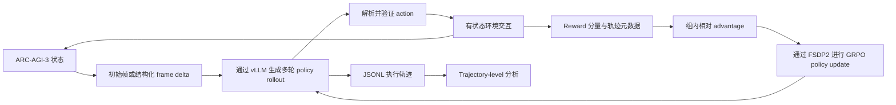

[English](README.md) | [简体中文](README_zh-CN.md)

# 面向 ARC-AGI-3 的长程 LLM Agent 后训练

本研究产物探索如何在反馈稀疏且可能被利用的长程交互环境中，对语言模型 Agent 进行后训练。

**状态：** 研究产物正在整理发布 · **时间：** 2026 年 1–5 月 · **主要任务：** ARC-AGI-3 `ft09` · **配套工具：** [RLM Trajectory Viewer](https://github.com/yuran986/Trajectoryvisualizationwebpage)

## 摘要

ARC-AGI-3 在有状态环境中同时要求视觉 grounding、隐藏规则发现、探索与延迟信用分配。本项目研究外部化递归推理和强化学习后训练能否改善 LLM Agent 在这类任务上的表现。我们首先构建了通过 REPL 与环境交互的 zero-shot Recursive Language Model（RLM）Agent，随后将 ARC-AGI-3 接入 SkyRL，使用 Qwen2.5-3B 和 Qwen3-8B 策略进行有状态多轮 GRPO。系统包括结构化 frame-diff observation、分量化 reward、oracle-distance warm-up、KL 正则化、FSDP2 分布式训练、vLLM rollout 生成和 trajectory-level 可视化。

实验**没有**得到能够稳定完成关卡的策略。核心结果是一个诊断性负结论：更密集的 shaping 提高了 scalar reward，但 `pass@1` 和完成关卡数没有变化。轨迹检查表明，策略利用了一个可重复的局部变化，而没有学会持续的视觉推理。因此，本项目的贡献是端到端实验系统，以及关于长程 Agent 奖励设计的受控负结果，而不是已经解决 ARC-AGI-3 的策略。

> **主要发现：** reward 提升不等于能力提升。在最强的受控对照中，16 条采样轨迹都找到了同一个 oracle-progress 动作，随后在 160 个动作中产生 144 个无进展动作；完成关卡数仍为 0。

## 主要贡献

- 建立端到端的有状态 ARC-AGI-3 集成，覆盖多轮 rollout、action 验证、分解 reward、GRPO update 与轨迹记录。
- 设计 token-efficient observation：初始完整 frame，随后仅提供结构化相邻帧 delta 和局部变化 patch。
- 通过 oracle-distance、no-progress penalty、meaningful-diff 和 KL 受控消融，区分 scalar reward 提升与真实任务进展。
- 建立轨迹分析流程，对齐模型 reasoning、REPL 执行、动作和动作后 frame，从而定位行为级失败模式。

## 方法



### 阶段一：Zero-shot 递归推理

我们将 [RLM](https://github.com/alexzhang13/rlm) 适配到 ARC-AGI-3，把环境状态与动作暴露为 REPL 函数，并通过 vLLM 在本地部署 GLM-4.7-Flash。外部变量使模型能够保存 frame、裁剪区域、计算 diff，并在不将每个完整 observation 都放入 prompt 的情况下查询长上下文。该 baseline 产生了可解释的探索轨迹，但仍高度依赖基座模型，并受长上下文、空间 grounding 较弱、无效动作重复和早期错误后难以恢复等问题限制。

### 阶段二：有状态多轮 GRPO

我们实现了能够跨 turn 保留游戏状态的 SkyRL 环境，对文本和坐标动作进行验证，并记录完整 transition 历史。每条 rollout 输出 reasoning 和最终 action block；环境只执行最后一个 action，检查它是否属于当前 action space，推进游戏，并返回下一条紧凑 observation 和分解后的 reward。

### Observation 设计

初始 turn 包含目标、可用动作、坐标范围、颜色图例和完整 `64×64` frame。后续 turn 包含上一步动作、环境状态和相邻 frame delta：

```text
observation_t = state_t + action_{t-1} + diff(frame_{t-1}, frame_t) + local changed patches
```

Diff metadata 包括变化 cell 数、bounding box、颜色转换计数和 connected components。由于 SkyRL 已保存完整的多轮 chat history，observation 中重复的上一轮模型输出被移除。

### Reward 设计

基础 reward 将真实任务进展与较弱的行为 shaping 组合：

```text
r_t = level_progress + meaningful_diff - invalid_action - repeated_click
```

在 warm-up 实验中，一个遵守环境 action 接口的 game-specific solver 定义 oracle distance `d(s)`，以 potential-style progress 提供信号，而不要求策略模仿唯一动作序列：

```text
oracle_progress_t = [d(s_{t-1}) - d(s_t)] × oracle_distance_reward
```

进入不可恢复状态时会受到额外惩罚。该信号适合受控诊断，但由于编码了 `ft09` 特定知识，并未被视为通用方案。

## 实验设置

| 维度 | 配置 |
|---|---|
| 环境 | ARC-AGI-3，主要实验游戏为 `ft09` |
| Zero-shot 模型 | 通过 vLLM 部署的 GLM-4.7-Flash |
| 可训练策略 | Qwen2.5-3B-Instruct；Qwen3-8B |
| 优化 | 有状态多轮 GRPO，可选 KL 正则化 |
| 训练系统 | SkyRL、PyTorch FSDP2、vLLM |
| 硬件 | 4×NVIDIA A6000；典型为 2 张训练 + 2 张 rollout，部分 Qwen3 实验为 3+1 |
| Context 配置 | 在定位 8K token 附近提前终止后扩展至 16K/18K |
| 主要指标 | `pass@1`、完成关卡数、非法动作、oracle progress、无进展动作、reward components |

## 实验结果

### Oracle-distance warm-up 消融

| 版本 | 关键变化 | 最终 avg. score | `pass@1` | 完成关卡数 | 行为结果 |
|---|---|---:|---:|---:|---|
| v1 | Oracle progress + 弱 meaningful-diff reward | `0.055` | `0.0` | `0.0` | 学会一次 progress transition，随后停滞 |
| v2 | 加入 `-0.01` no-progress penalty | `-0.035` | `0.0` | `0.0` | 接受重复惩罚，而没有找到下一步 transition |
| v3 | 将 meaningful-diff reward 提高至 `0.01` | `-0.030` | `0.0` | `0.0` | 行为不变；step 200 时 16/160 progress、144/160 no-progress |

由于 reward 定义发生变化，不同版本的 scalar reward **不能直接比较**。任务指标保持一致：所有版本的 `pass@1` 和完成关卡数均为 0。v2→v3 表面的分数提升可由更大的 shaping 系数解释，而非行为改善。

### 失败分析

| 观察 | 证据 | 含义 |
|---|---|---|
| 合法 action 并不充分 | 非法动作降至 0，但任务进展仍为 0 | 必须分别评估格式/控制学习与任务学习 |
| Dense reward 会强化局部最优 | 策略重复点击能稳定改变像素的区域 | 辅助 reward 必须接受行为级审计，不能只看 aggregate curve |
| 提供 diff 不代表完成 grounding | 收到 38-cell delta 后，Agent 有时仍声称没有变化 | Observation 压缩与 observation 使用是两个问题 |
| 惩罚不会自动产生探索 | No-progress penalty 改变了分数，但没有改变动作模式 | 逃离局部策略可能需要 curriculum、demonstration 或更强 search |
| KL 是稳定器而非任务监督 | 更高 KL 限制了策略坍缩，但没有教会隐藏视觉规则 | 保守更新无法代替有信息量的初始化 |

## 轨迹分析

<p align="center">
  
</p>

<p align="center"><em>配套 Viewer 对齐实时/离线 frame、运行元数据、模型回复、REPL 执行、action event 和每轮动作数。图中 zero-shot 轨迹以 GAME_OVER 结束，完成关卡数为 0。</em></p>

[RLM Trajectory Viewer](https://github.com/yuran986/Trajectoryvisualizationwebpage) 提供动态演示与实现细节。它用于实验审计：将 aggregate reward 还原为具体行为，并暴露重复点击、忽略状态变化、长度截断和 action-to-frame 错配。

## 辅助测试环境：ALE-Bench

ARC-AGI-3 将视觉 grounding、隐藏规则和稀疏终局反馈耦合在一起。为了区分任务难度和 RL pipeline 失败，我们还实现了探索性的 ALE-Bench 集成，包括代码解析、public judge 执行、signed/normalized verifier reward、多轮 improvement signal、SkyRL launcher、适配集群环境的 Apptainer backend 和 rollout viewer。该分支已经形成最小可训练系统，但尚未得到稳定训练提升；它仍是辅助诊断 testbed，而不是已报告的正结果。

## Artifact 与复现状态

| Artifact | 状态 |
|---|---|
| 研究设计、实验配置与负结果 | 已在本 README 中记录 |
| 交互式轨迹 Viewer | 已在[配套仓库](https://github.com/yuran986/Trajectoryvisualizationwebpage)公开 |
| 脱敏的代表性轨迹 | 整理中 |
| RLM 环境 adapter 与 baseline launcher | 整理中 |
| SkyRL 环境、reward 代码与训练配置 | 整理中 |
| CPU tests 与端到端复现说明 | 整理中 |

当前仓库应被视为分阶段发布的研究产物，而不是已经可以一键复现的完整 package。Checkpoint、原始日志、私有集群路径和受限制的环境资产不会公开。

## 局限性

- 受控 ARC 实验只覆盖有限的游戏，主要为 `ft09`；是否适用于其他游戏仍需验证。
- Oracle distance 是 game-specific ablation，而非通用 ARC-AGI-3 方法。
- Reward 系数发生变化，因此不能直接比较所有 run 的原始 scalar score。
- 更强基座模型和所测试的 KL 设置均未得到稳定 level completion。
- 实验尚未扩展到广泛的跨游戏评测，本文也不宣称取得正向 benchmark 结果。

## 引用

如果本研究产物对你的工作有帮助，请引用：

```bibtex
@misc{zhang2026longhorizonarcagi3,
  author       = {Yingjie Zhang},
  title        = {Long-Horizon LLM Agent Post-Training for ARC-AGI-3},
  year         = {2026},
  howpublished = {\url{https://github.com/yuran986/arc-agi-3-agent-post-training}}
}
```

## 致谢

本项目基于 [ARC-AGI-3](https://arcprize.org/arc-agi/3/)、[RLM](https://github.com/alexzhang13/rlm)、[SkyRL](https://github.com/NovaSky-AI/SkyRL)、vLLM 和 PyTorch FSDP2。
