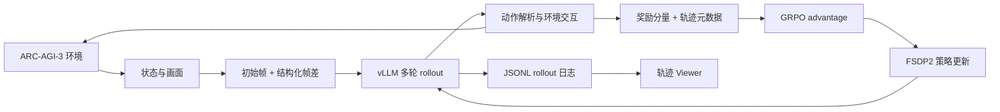

[English](README.md) | [简体中文](README_zh-CN.md)

# 面向 ARC-AGI-3 的长程 LLM Agent 后训练

一个探索性研究项目：通过递归推理、多轮强化学习、紧凑视觉观测和轨迹级诊断，使语言模型 Agent 适应长程、交互式 ARC-AGI-3 环境。

> **项目状态。** 本项目建立了端到端的训练与分析流程，但尚未获得能够稳定完成关卡的策略。当前最有价值的产出是系统基础设施、失败分析，以及对后续长程 Agent 训练的经验总结。代码和经过清理的实验产物正在逐步整理到本仓库中。

## 轨迹可视化工具

<p align="center">
  
</p>

<p align="center"><em>一次以 GAME_OVER 结束且未完成任何关卡的 zero-shot RLM 轨迹。Viewer 将环境画面与模型回复、REPL 执行、动作和运行元数据对齐，便于定位失败原因。</em></p>

交互式 Viewer 支持：

- 拖放并回放 RLM 与 ARC 环境的 JSONL 日志；
- 实时监控和离线检查长程轨迹；
- 同步展示画面、动作、模型回复、REPL/工具输出与耗时；
- 在多次运行之间按 completion 和 iteration 导航。

Viewer 源码：[Trajectoryvisualizationwebpage](https://github.com/yuran986/Trajectoryvisualizationwebpage)

## 研究问题

- 不进行特定任务训练时，递归语言模型推理能否直接解决交互式 ARC 任务？
- 有状态的多轮强化学习能否改善探索和延迟信用分配？
- 如何压缩视觉状态，同时保留 grounding 所需的关键信息？
- 哪些奖励信号能够改善真实任务进展，而不只是提高训练分数？

## 项目历程

### 1. Zero-shot 递归推理

我首先将 [Recursive Language Models（RLM）](https://github.com/alexzhang13/rlm)适配到 ARC-AGI-3 交互环境，并使用 vLLM 在本地部署 GLM-4.7-Flash。Agent 能够通过 REPL 检查状态并执行动作，但长轨迹暴露出视觉 grounding 较弱、上下文快速增长、无效动作重复，以及早期决策出错后难以恢复等问题。

### 2. 多轮后训练

随后，我基于 [SkyRL](https://github.com/NovaSky-AI/SkyRL) 搭建了有状态的 GRPO 训练流程，在 4×A6000 节点上使用 Qwen2.5-3B 和 Qwen3-8B 策略，结合 FSDP2 训练与 vLLM rollout。环境封装能够跨轮保留游戏状态，并记录完整轨迹供后续分析。

为了降低观测长度，每条 rollout 仅在开始时提供完整画面，之后使用结构化的相邻帧差异和局部变化 patch，而不是反复序列化整个屏幕。

### 3. 奖励与优化消融

稠密的进度信号降低了优化难度，但 Agent 学会了通过重复点击累积 scalar reward，而没有真正完成关卡。我还测试了：

- **Oracle-distance warm-up：** 能提供更清晰的进度信号，但引入了游戏特定知识；由于难以泛化到其他游戏，最终放弃；
- **KL 正则化：** 能约束策略漂移，但在当前实验设置中的实际收益有限；
- **受控奖励塑形：** 用于区分分数提升与真实环境进展，并更清晰地识别 reward hacking。

由于在 ARC-AGI-3 上难以区分训练流程本身的问题与稀疏反馈导致的探索失败，我还开始将系统实验性地适配到 **ALE-Bench**，将其作为反馈更密集的测试环境。这条分支仍处于探索阶段，并未形成完整的 benchmark 研究。

## 系统概览



## 主要结论

- 训练 reward 上升并不代表关卡完成能力有所提升。
- 稠密 scalar reward 会产生可利用的局部激励，尤其容易诱发重复动作循环。
- 紧凑帧差降低了上下文开销，但仅提高表示效率无法解决视觉 grounding。
- 长程交互会放大早期错误，也使稀疏终局反馈难以完成信用分配。
- Oracle guidance 能稳定单一任务，却可能损害跨游戏泛化这一目标。
- 如果缺少更好的状态抽象、探索机制和进度信号，仅增强基座模型或增加 KL 约束并不足够。

## 实验组件

| 组件 | 作用 | 结果 |
|---|---|---|
| Zero-shot RLM Agent | 测试不经训练的递归推理 | 生成了有分析价值的轨迹，但无法可靠完成关卡 |
| 有状态 SkyRL 环境 | 在 rollout 多轮交互中保留状态 | 支持端到端多轮 GRPO 实验 |
| 初始帧 + 帧差 | 限制观测 token 增长 | 轨迹更紧凑，但 grounding 仍是瓶颈 |
| 稠密奖励塑形 | 提供中间学习信号 | scalar reward 提升，但暴露出 reward hacking |
| Oracle-distance warm-up | 提供有方向的早期监督 | 对特定游戏依赖过强，不符合泛化目标 |
| KL 正则化 | 限制破坏性的策略漂移 | 训练可稳定运行，但观察到的收益有限 |
| ALE-Bench 适配 | 在反馈更密集的环境中测试训练流程 | 用于探索任务难度与反馈稀疏性的实验分支 |
| 轨迹 Viewer | 对齐行为、状态与训练信号 | 使重复动作和 grounding 失败能够被直观检查 |

## 仓库路线图

- [x] 补充项目概览与研究结论
- [x] 发布轨迹 Viewer 示例
- [ ] 提取环境适配器与观测编码器
- [ ] 加入清理后的训练配置与启动脚本
- [ ] 发布代表性轨迹与评测总结
- [ ] 编写可复现的环境配置和评测命令

## 计划中的仓库结构

```text
.
├── configs/          # 清理后的实验配置
├── docs/             # 设计笔记与实验总结
├── examples/         # 示例 rollout 与使用方式
├── fig/              # README 与分析图片
├── scripts/          # 训练、推理服务与评测入口
├── src/              # 环境、观测、奖励与日志代码
└── viewer/           # Viewer 集成说明或子模块引用
```

## 局限性

这是一个探索性研究项目，而非已经完成的 benchmark 结果。实验覆盖的游戏和算力预算有限，oracle-guided 与 KL-regularized 方案也都没有形成通用解法。因此，上述结论主要是定性分析，旨在指导下一阶段研究，而不是宣称已经取得 ARC-AGI-3 性能结果。

## 致谢

本项目基于 [ARC-AGI-3](https://arcprize.org/arc-agi/3/)、[RLM](https://github.com/alexzhang13/rlm)、[SkyRL](https://github.com/NovaSky-AI/SkyRL)、vLLM 与 PyTorch FSDP2。
